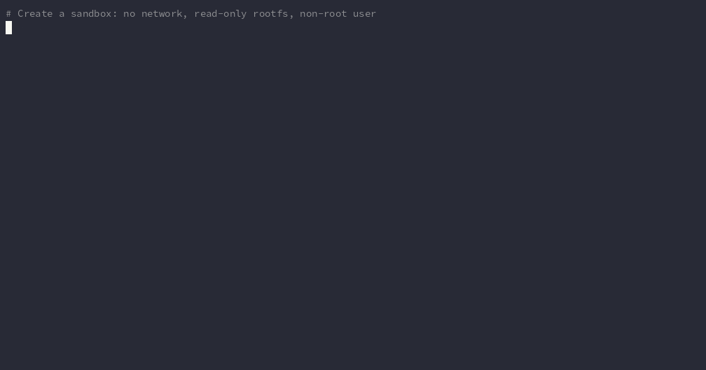
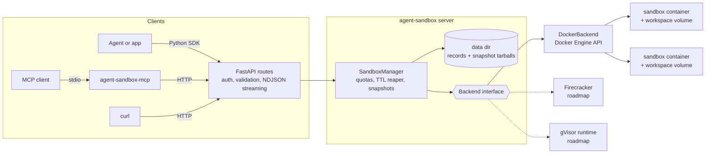

# agent-sandbox

**Self-hostable, disposable sandboxes where AI agents run code, with snapshot, rollback, and fork.**

[](https://github.com/superintelligenceco/agent-sandbox/actions/workflows/ci.yml)
[](https://github.com/superintelligenceco/agent-sandbox/actions/workflows/codeql.yml)
[](https://scorecard.dev/viewer/?uri=github.com/superintelligenceco/agent-sandbox)
[](https://pypi.org/project/sic-agent-sandbox/)
[](https://superintelligenceco.github.io/agent-sandbox/)
[](LICENSE)
[](https://codespaces.new/superintelligenceco/agent-sandbox)

You give an agent a sandbox. The agent writes files, runs commands, and streams
the output. Before it tries something risky, it takes a snapshot. When the attempt
goes wrong, it rolls back in one call, or forks the snapshot into several sandboxes
and tries three ideas in parallel. When the agent forgets to clean up, the TTL
reaper does it for you.

agent-sandbox is a small Python server with a REST API, a Python SDK, and an MCP
server. It runs on any Linux host with Docker, and your code never leaves your
infrastructure.



The [documentation site](https://superintelligenceco.github.io/agent-sandbox/)
has a quickstart, concepts, the architecture, references, and an FAQ.

## Install

Install the standalone `agent-sandbox` executable for your OS and CPU:

```sh
curl -fsSL https://raw.githubusercontent.com/superintelligenceco/agent-sandbox/main/install.sh | sh
```

The script checks the download against the release's `SHA256SUMS` and installs
it into `~/.local/bin`. Set `AGENT_SANDBOX_VERSION=v0.2.1` to pin a release, or
`AGENT_SANDBOX_INSTALL=compose` to download the Compose file, write an API key,
and start the server image instead. Then start the server with
`AGENT_SANDBOX_API_KEYS=$(openssl rand -hex 24) agent-sandbox serve`. Your user
needs access to the Docker socket.

Or install the Python package from PyPI. The distribution is
`sic-agent-sandbox`; the import package and the commands keep the
`agent_sandbox` and `agent-sandbox` names:

```sh
pip install "sic-agent-sandbox[server,mcp]"
```

Each release ships these files:

| Artifact | Where |
| --- | --- |
| Executables | `agent-sandbox-linux-x86_64`, `agent-sandbox-linux-aarch64`, `agent-sandbox-macos-arm64`, and `agent-sandbox-windows-x86_64.exe` on the [latest release](https://github.com/superintelligenceco/agent-sandbox/releases/latest) |
| Server image | `ghcr.io/superintelligenceco/agent-sandbox:vX.Y.Z`, `:latest` (newest release), `:edge` (newest manual build of `main`), for `linux/amd64` and `linux/arm64`, signed with cosign |
| Compose file | `docker-compose.yml` on the release, pinned to the release's image |
| Python package | [`sic-agent-sandbox` on PyPI](https://pypi.org/project/sic-agent-sandbox/), plus the wheel and sdist on the release |
| Supply chain | `SHA256SUMS`, SPDX SBOMs of the package and the image, and build provenance attestations |

Verify a downloaded file with
`gh attestation verify <file> -R superintelligenceco/agent-sandbox`.

### Run the server with Docker Compose

You need a Linux host with Docker and the Compose plugin. Download the Compose
file, set an API key, and start the server:

```sh
curl -fsSLO https://github.com/superintelligenceco/agent-sandbox/releases/latest/download/docker-compose.yml
export AGENT_SANDBOX_API_KEY=$(openssl rand -hex 24)
docker compose up -d
```

The API now listens on `http://localhost:8080`. Check it with
`curl localhost:8080/healthz`. The Compose file pins the image of its release.
Set `AGENT_SANDBOX_VERSION` to run another tag, `AGENT_SANDBOX_PORT` to change
the host port, and `AGENT_SANDBOX_DEFAULT_IMAGE` to change the sandbox image.
Stop the server and delete its data with `docker compose down -v`.

To run the image without Compose:

```sh
docker run -d --name agent-sandbox -u 0:0 -p 127.0.0.1:8080:8080 \
  -v /var/run/docker.sock:/var/run/docker.sock -v agent-sandbox-data:/data \
  -e AGENT_SANDBOX_API_KEYS="$AGENT_SANDBOX_API_KEY" \
  ghcr.io/superintelligenceco/agent-sandbox:latest
```

### Install the Python SDK and MCP server

```sh
pip install "sic-agent-sandbox[mcp]"
agent-sandbox-mcp   # MCP server over stdio
```

Leave out `[mcp]` if you only need the SDK, which depends on `httpx` alone.

### Build from source

```sh
git clone https://github.com/superintelligenceco/agent-sandbox && cd agent-sandbox
export AGENT_SANDBOX_API_KEY=$(openssl rand -hex 24)
docker compose -f docker-compose.yml -f docker-compose.build.yml up -d --build
```

## See it work

This session is a verbatim capture from a Compose stack, with `$API` set
to `http://localhost:8080/v1`.

```console
$ sb() { curl -s -H "Authorization: Bearer $AGENT_SANDBOX_API_KEY" -H "Content-Type: application/json" "$@"; }

# 1. Create a sandbox (no network, read-only rootfs, non-root user by default).
$ SB=$(sb -X POST $API/sandboxes -d '{"image": "python:3.12-slim", "timeout_seconds": 600}' | jq -r .id); echo $SB
sb_2f10f5a9403f25d0

# 2. Write some code and run it.
$ sb -X PUT "$API/sandboxes/$SB/files?path=app.py" --data-binary 'print(sum(range(10)))' | jq -c .
{"name":"app.py","path":"/workspace/app.py","type":"file","size":21,"modified_at":"2026-09-30T09:56:02.053406Z"}
$ sb -X POST $API/sandboxes/$SB/exec -d '{"command": "python3 app.py && id"}' | jq .
{
  "stdout": "45\nuid=1000 gid=1000 groups=1000\n",
  "stderr": "",
  "exit_code": 0,
  "timed_out": false,
  "truncated": false,
  "duration_ms": 85
}

# 3. Snapshot the working state.
$ SNAP=$(sb -X POST $API/sandboxes/$SB/snapshots -d '{"name": "working"}' | jq -r .id); echo $SNAP
snap_485f667dcf5910ac

# 4. Break something.
$ sb -X POST $API/sandboxes/$SB/exec -d '{"command": "rm -rf /workspace/* && python3 app.py"}' | jq .
{
  "stdout": "",
  "stderr": "python3: can't open file '/workspace/app.py': [Errno 2] No such file or directory\n",
  "exit_code": 2,
  "timed_out": false,
  "truncated": false,
  "duration_ms": 95
}

# 5. Roll back and stream the output of the next command.
$ sb -X POST $API/sandboxes/$SB/rollback -d "{\"snapshot_id\": \"$SNAP\"}" | jq -c "{id, status, source_snapshot_id}"
{"id":"sb_2f10f5a9403f25d0","status":"running","source_snapshot_id":"snap_485f667dcf5910ac"}
$ sb -X POST $API/sandboxes/$SB/exec/stream -d '{"command": "python3 app.py; ls -l"}'
{"type": "stdout", "data": "45\n"}
{"type": "stdout", "data": "total 4\n-rw-r--r--. 1 1000 1000 21 Sep 30 09:56 app.py\n"}
{"type": "exit", "exit_code": 0, "timed_out": false, "duration_ms": 121}

# 6. Clean up.
$ sb -X DELETE -o /dev/null -w "%{http_code}\n" $API/sandboxes/$SB
204
```

### The same thing from Python

```sh
pip install sic-agent-sandbox
export AGENT_SANDBOX_URL=http://localhost:8080
```

```python
from agent_sandbox.client import SandboxClient

with SandboxClient() as client, client.create(image="python:3.12-slim") as sandbox:
    sandbox.write_file("app.py", "print('hello from', __import__('platform').python_version())\n")
    good = sandbox.snapshot("working")
    sandbox.exec("rm app.py")
    sandbox.rollback(good)
    for event in sandbox.exec_stream("python3 app.py"):
        print(event)
```

Output of [`examples/quickstart.py`](examples/quickstart.py), which runs a longer
version of this code:

```text
created Sandbox(id='sb_2bc35260898babc9', image='python:3.12-slim', status='running')
run 1: hello from 3.12.13
snapshot snap_bdb4731b7ddb7b93 (10240 bytes)
after rm: exit 2 | python3: can't open file '/workspace/app.py': [Errno 2] No such file or directory
after rollback: hello from 3.12.13
stream: ExecEvent(type='stdout', data='tick 1\n', exit_code=None, timed_out=False, duration_ms=None)
stream: ExecEvent(type='stdout', data='tick 2\n', exit_code=None, timed_out=False, duration_ms=None)
stream: ExecEvent(type='stdout', data='tick 3\n', exit_code=None, timed_out=False, duration_ms=None)
stream: ExecEvent(type='exit', data='', exit_code=0, timed_out=False, duration_ms=641)
```

[`examples/parallel_forks.py`](examples/parallel_forks.py) forks one snapshot
into three sandboxes, benchmarks a different implementation in each, and prints
the results.

### From an MCP client

Install the package with the `mcp` extra (see [Install](#install)) and point your
MCP client at the `agent-sandbox-mcp` command. It speaks MCP over stdio.

```json
{
  "mcpServers": {
    "agent-sandbox": {
      "command": "agent-sandbox-mcp",
      "env": {
        "AGENT_SANDBOX_URL": "http://localhost:8080",
        "AGENT_SANDBOX_API_KEY": "replace-with-your-key"
      }
    }
  }
}
```

The server exposes ten tools: `sandbox_create`, `sandbox_list`, `sandbox_exec`,
`sandbox_read_file`, `sandbox_write_file`, `sandbox_list_files`,
`sandbox_snapshot`, `sandbox_rollback`, `sandbox_fork`, and `sandbox_destroy`.
Its instructions tell the model to snapshot before risky changes.

## Why it exists

Agents that write code need somewhere to run it. Running it on the host is
dangerous, and hosted sandbox services mean your code, data, and credentials leave
your network. agent-sandbox gives you the useful parts of those services on a
machine you control:

- **Disposable by default.** Every sandbox has a time to live, and the server
  reaps it when the TTL passes.
- **Undo for agents.** Snapshot, rollback, and fork are first-class API calls,
  so an agent can explore without losing a known-good state.
- **Small enough to read.** About 2,500 lines of Python. You can audit the
  whole isolation path in an afternoon.

## Features

- REST API with an [OpenAPI 3.1 spec](docs/openapi.json). FastAPI also serves
  interactive docs at `/docs`.
- Create sandboxes from any OCI image, with CPU, memory, process-count, and TTL
  limits, and network access off or on.
- Run commands to completion, or stream stdout and stderr as NDJSON while they
  run. Timeouts kill the whole process group.
- Read, write, and list files. Uploads and downloads are raw bytes, so binary
  files work.
- Snapshot `/workspace`, roll back to a snapshot, and fork a snapshot into a new
  sandbox. Snapshots outlive the sandbox they came from.
- TTL reaping, per-server quotas, an image allowlist, and orphan cleanup when the
  server restarts.
- API key authentication with `Authorization: Bearer` or `X-API-Key`.
- Python SDK (`agent_sandbox.client`, depends only on `httpx`) and an MCP server.
- A `Backend` interface, so other isolation technologies can plug in. Docker is
  the backend that ships today.

## API overview

Every `/v1` route needs an API key. The [OpenAPI spec](docs/openapi.json) holds
the full request and response schemas.

| Method and path | What it does |
| --- | --- |
| `GET /healthz` | Report whether the server can reach Docker. No key needed. |
| `POST /v1/sandboxes` | Create and start a sandbox. |
| `GET /v1/sandboxes` | List live sandboxes. |
| `GET /v1/sandboxes/{id}` | Get one sandbox. |
| `DELETE /v1/sandboxes/{id}` | Destroy a sandbox and its workspace. Its snapshots remain. |
| `POST /v1/sandboxes/{id}/timeout` | Reset the TTL, counted from now. |
| `POST /v1/sandboxes/{id}/exec` | Run a command and return stdout, stderr, and the exit code. |
| `POST /v1/sandboxes/{id}/exec/stream` | Run a command and stream NDJSON events as output arrives. |
| `GET /v1/sandboxes/{id}/files?path=` | Download a file. |
| `PUT /v1/sandboxes/{id}/files?path=&mode=` | Upload a file into `/workspace`. |
| `GET /v1/sandboxes/{id}/files/list?path=` | List a directory. |
| `POST /v1/sandboxes/{id}/snapshots` | Snapshot `/workspace`. |
| `POST /v1/sandboxes/{id}/rollback` | Restore a snapshot into the sandbox. |
| `GET /v1/snapshots` | List snapshots, optionally for one sandbox. |
| `GET /v1/snapshots/{id}` | Get one snapshot. |
| `DELETE /v1/snapshots/{id}` | Delete a snapshot. |
| `POST /v1/snapshots/{id}/fork` | Start a new sandbox from a snapshot. |

Errors share one shape: `{"error": {"code": "not_found", "message": "..."}}`.

### Configuration

You configure the server with environment variables. The most common ones:

| Variable | Default | Meaning |
| --- | --- | --- |
| `AGENT_SANDBOX_API_KEYS` | none | Comma-separated keys, each at least 16 characters. Required. |
| `AGENT_SANDBOX_DEFAULT_IMAGE` | `python:3.12-slim` | Image used when a request doesn't name one. |
| `AGENT_SANDBOX_ALLOWED_IMAGES` | `*` | Comma-separated glob patterns, for example `python:*,node:22*`. |
| `AGENT_SANDBOX_ALLOW_NETWORK` | `true` | Set to `false` to refuse sandboxes that request network access. |
| `AGENT_SANDBOX_MAX_SANDBOXES` | `20` | Maximum number of live sandboxes. |
| `AGENT_SANDBOX_DEFAULT_TIMEOUT_SECONDS` | `900` | TTL when a request doesn't set one. |
| `AGENT_SANDBOX_MAX_CPUS` / `_MAX_MEMORY_MB` | `4` / `4096` | Upper bounds a request can ask for. |
| `AGENT_SANDBOX_DOCKER_RUNTIME` | empty | OCI runtime for sandboxes, for example `runsc`. See the roadmap. |
| `AGENT_SANDBOX_DATA_DIR` | `./data` | Where sandbox records and snapshot tarballs live. |

[`config.py`](src/agent_sandbox/config.py) lists every setting.

## Security model

Read this section before you expose the server to anything you don't trust.

### What a sandbox gets by default

Each sandbox is one Docker container plus one named volume mounted at
`/workspace`. The container runs with:

- A non-root user (`1000:1000`), and `HOME=/workspace`.
- Every Linux capability dropped and `no-new-privileges` set.
- A read-only root filesystem. Only `/workspace` (a volume) and `/tmp` (a
  size-limited `nosuid,nodev` tmpfs) are writable.
- No network interface except loopback. When you request `network: true`, the
  sandbox joins a dedicated bridge network with inter-container traffic disabled.
- Memory, CPU, and process-count limits, with swap disabled.
- A private IPC namespace and an init process that reaps zombies.
- A fixed hostname and no host mounts other than its own volume.

The integration tests check each of these properties against a real Docker
daemon on every CI run.

### Honest limits

- **Containers are not virtual machines.** Every sandbox shares the host kernel.
  A kernel vulnerability can let code escape the container. If you run code from
  untrusted users, not only from your own agents, use a stronger runtime such as
  gVisor, or put the whole host inside a VM you're willing to lose.
- **The server controls Docker.** It needs the Docker socket, and access to the
  Docker socket is equivalent to root on the host. Treat the API key as a root
  credential, keep the port on localhost or behind TLS, and consider a Docker
  socket proxy that allows only the container, volume, image, network, and exec
  endpoints.
- **Network access is coarse.** `network: true` means outbound access to
  wherever the host can reach, which can include your LAN and cloud metadata
  endpoints. There's no egress allowlist yet. Leave networking off unless the
  task needs it, or block those ranges on the host.
- **Snapshots cover `/workspace` only.** Snapshots don't capture memory, running
  processes, `/tmp`, or changes to the root filesystem when you turn off
  `read_only_rootfs`. Rollback replaces the container, so all of that resets.
- **Limits aren't complete.** Disk use inside `/workspace` has no quota on most
  Docker storage drivers, and snapshot size has a server-side cap
  (`AGENT_SANDBOX_MAX_SNAPSHOT_BYTES`) but no per-key budget.
- **API keys are flat.** Every key can see and control every sandbox. There are
  no per-key namespaces yet.

Report vulnerabilities as described in [SECURITY.md](SECURITY.md).

## Architecture



- **API layer** ([`api.py`](src/agent_sandbox/api.py)) validates requests with
  Pydantic, checks the API key, and maps errors to HTTP status codes.
- **Manager** ([`manager.py`](src/agent_sandbox/manager.py)) owns IDs, quotas,
  TTLs, locking, and snapshot storage. It persists sandbox records so a restarted
  server picks up its sandboxes and removes orphans.
- **Backend** ([`backends/base.py`](src/agent_sandbox/backends/base.py)) is the
  interface an isolation technology implements: create, destroy, exec, file I/O,
  and workspace export and import as tar streams.
- **Docker backend** ([`backends/docker.py`](src/agent_sandbox/backends/docker.py))
  implements that interface with hardened containers.

A snapshot is a tar of `/workspace` stored in the data directory. Rollback
destroys the container, creates a fresh one with the same spec, and extracts the
tar into the new workspace. Fork does the same into a new sandbox ID.

## Development

Open the repository in a GitHub Codespace, or in the dev container in
`.devcontainer/`, to get Python, Docker, and every dependency installed. On
your own machine:

```sh
make setup            # create .venv and install the dev and docs extras
. .venv/bin/activate
pre-commit install    # run the CI linters on every commit
make lint typecheck test
make test-integration # needs a Docker daemon you can reach
make docs             # build the documentation site into site/
agent-sandbox openapi -o docs/openapi.json   # after any API change
```

Run `make` to list every target. Run the server from source with
`AGENT_SANDBOX_API_KEYS=<key> agent-sandbox serve`.

## Roadmap

These items are plans, not features. Nothing here ships today.

- **gVisor.** `AGENT_SANDBOX_DOCKER_RUNTIME=runsc` already passes the runtime to
  Docker, but the project doesn't test or support it yet. The goal is a CI job
  that runs the integration suite under gVisor.
- **Firecracker.** A backend that runs each sandbox in a microVM, with
  snapshots of the full VM, including memory.
- **Egress control.** Per-sandbox allowlists for outbound network traffic.
- **Multi-tenant keys.** Sandboxes scoped to the API key that created them, with
  per-key quotas.
- **TypeScript SDK.**
- **Workspace quotas** on storage drivers that support them.

## Contributing

Read [CONTRIBUTING.md](CONTRIBUTING.md) to set up a development environment and
open a pull request. Everyone who takes part agrees to the
[code of conduct](CODE_OF_CONDUCT.md).

## License

Apache-2.0. See [LICENSE](LICENSE).
