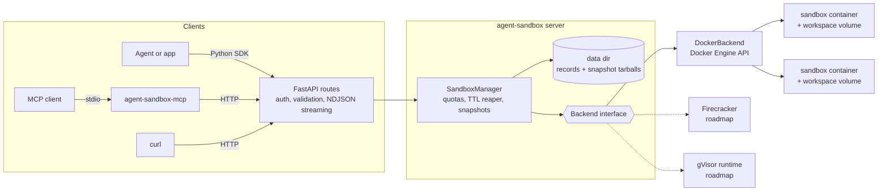
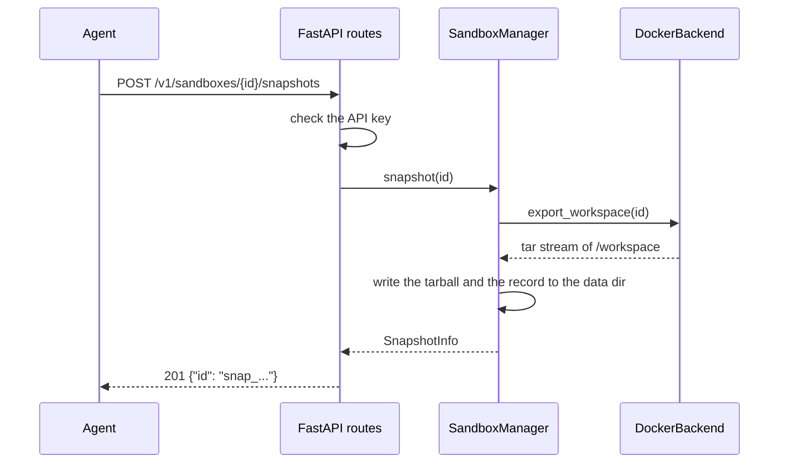

# Architecture

- **API layer** ([`api.py`](https://github.com/superintelligenceco/agent-sandbox/blob/main/src/agent_sandbox/api.py)) validates requests with
  Pydantic, checks the API key, and maps errors to HTTP status codes.
- **Manager** ([`manager.py`](https://github.com/superintelligenceco/agent-sandbox/blob/main/src/agent_sandbox/manager.py)) owns IDs, quotas,
  TTLs, locking, and snapshot storage. It persists sandbox records so a restarted
  server picks up its sandboxes and removes orphans.
- **Backend** ([`backends/base.py`](https://github.com/superintelligenceco/agent-sandbox/blob/main/src/agent_sandbox/backends/base.py)) is the
  interface an isolation technology implements: create, destroy, exec, file I/O,
  and workspace export and import as tar streams.
- **Docker backend** ([`backends/docker.py`](https://github.com/superintelligenceco/agent-sandbox/blob/main/src/agent_sandbox/backends/docker.py))
  implements that interface with hardened containers.

A snapshot is a tar of `/workspace` stored in the data directory. Rollback
destroys the container, creates a fresh one with the same spec, and extracts the
tar into the new workspace. Fork does the same into a new sandbox ID.

## Request flow

The [decision records](adr/index.md) explain why the pieces look the way they do.
